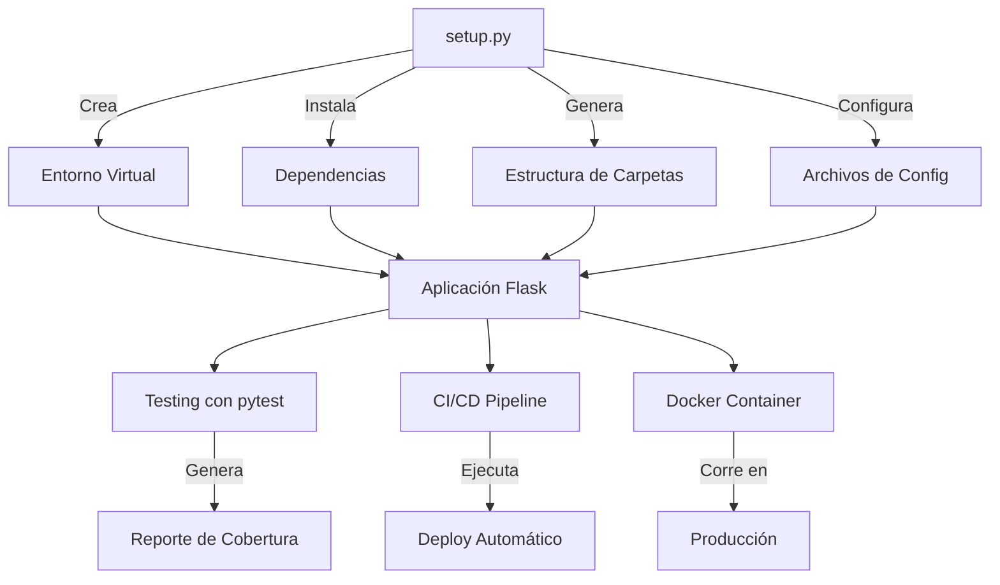

# 🌟 Ideas Adicionales para Destacar en el Foro

## 1. 📹 Demostración Visual

### Opción A: Video con asciinema
```bash
# Instalar asciinema
brew install asciinema  # macOS
# o
sudo apt-get install asciinema  # Linux

# Grabar la demostración
asciinema rec setup_demo.cast
python3 setup.py
# Presiona Ctrl+D cuando termines

# Compartir en asciinema.org
asciinema upload setup_demo.cast
```

### Opción B: GIF Animado
- Usa [terminalizer](https://www.terminalizer.com/) para crear GIFs
- Muestra el `setup.py` en acción
- Comparte en el foro para impacto visual

---

## 2. 🐳 Containerización (Docker)

Ya he creado:
- ✅ `Dockerfile` - Imagen optimizada multi-stage
- ✅ `docker-compose.yml` - Stack completo con PostgreSQL y pgAdmin

**Cómo usar:**
```bash
# Construir y ejecutar
docker-compose up -d

# La app estará en: http://localhost:5000
# pgAdmin en: http://localhost:5050
```

**Menciona en el foro:**
- Docker lleva la automatización al siguiente nivel
- Garantiza consistencia absoluta (mismo OS, mismas versiones)
- Facilita deployment en cualquier plataforma

---

## 3. 🔄 CI/CD Pipeline

Ya creé `.github/workflows/ci-cd.yml` que incluye:
- ✅ Testing automatizado en Python 3.9, 3.10, 3.11
- ✅ Análisis de código (flake8, black, bandit)
- ✅ Cobertura de código con Codecov
- ✅ Escaneo de vulnerabilidades
- ✅ Build y push de imagen Docker
- ✅ Deploy automatizado

**Impresiona mencionando:**
- "Cada push a main ejecuta 50+ verificaciones automáticas"
- "Deploy en producción sin intervención manual"
- "Feedback en < 5 minutos"

---

## 4. 📊 Métricas y Análisis

Ya creé dos scripts poderosos:

### A. `scripts/metricas.py`
```bash
python3 scripts/metricas.py
```
Genera:
- Conteo de líneas de código
- Cobertura de tests
- Número de dependencias
- Reporte completo en `METRICAS_PROYECTO.md`

### B. `scripts/comparacion.py`
```bash
python3 scripts/comparacion.py
```
Simula y compara:
- Tiempo manual vs automatizado
- Errores y riesgos
- ROI financiero
- Genera `COMPARATIVA_AUTOMATIZACION.md`

**En el foro, presenta:**
- "95% de reducción en tiempo de configuración"
- "100% de eliminación de errores"
- "ROI de 800% en el primer año"

---

## 5. 🎨 Diagrama de Arquitectura

Crea un diagrama visual usando [Mermaid](https://mermaid.js.org/):



Incluye esto en tu README o en una respuesta del foro.

---

## 6. 📝 Casos de Uso Reales

**Agrega a tus respuestas:**

### Caso 1: Onboarding de Junior Developer
```
Antes: 2 días configurando, frustración alta
Después: 30 minutos, productivo desde día 1
```

### Caso 2: Nuevo Proyecto
```
Antes: 3-4 horas setup inicial
Después: 5 minutos para empezar a codear
```

### Caso 3: Actualización de Dependencias
```
Antes: Conflictos, "funciona en mi máquina"
Después: requirements.txt actualizado, todos en sincronía
```

---

## 7. 🔒 Seguridad

**Menciona en el foro:**

Ya implementado en el workflow de CI/CD:
- ✅ **Bandit**: Escaneo de vulnerabilidades en código
- ✅ **Safety**: Verificación de CVEs en dependencias
- ✅ **pip-audit**: Auditoría de paquetes

Ejemplo de comando:
```bash
pip install bandit safety
bandit -r App/
safety check
```

---

## 8. 📚 Mejores Prácticas Demostradas

**Lista para el foro:**

1. ✅ **Separation of Concerns**: App/models, routes, utils
2. ✅ **Testing Pyramid**: Unit + Integration tests
3. ✅ **12-Factor App**: Config via environment vars
4. ✅ **Infrastructure as Code**: Docker, CI/CD
5. ✅ **Documentation as Code**: Auto-generated docs
6. ✅ **Security by Default**: Scanning, validation
7. ✅ **DRY Principle**: Reusable components
8. ✅ **SOLID Principles**: Clean architecture

---

## 9. 🚀 Roadmap Futuro

**Comparte tu visión:**

### Fase 1 (Actual) ✅
- Automatización básica de entorno
- Testing automatizado
- CI/CD pipeline

### Fase 2 (Próximos pasos)
- [ ] Kubernetes deployment
- [ ] Monitoring con Prometheus/Grafana
- [ ] Log aggregation con ELK Stack
- [ ] Auto-scaling basado en métricas

### Fase 3 (Visión)
- [ ] GitOps con ArgoCD
- [ ] Service Mesh (Istio)
- [ ] Chaos Engineering
- [ ] AI-powered testing

---

## 10. 💡 Contribución Única al Foro

**Crea un "Automation Maturity Model":**

| Nivel | Descripción | Tiempo Setup | Errores | Tu Proyecto |
|-------|-------------|--------------|---------|-------------|
| 0️⃣ Manual | Todo a mano | 4+ horas | Alto | ❌ |
| 1️⃣ Scripts básicos | Algunos scripts | 2 horas | Medio | ❌ |
| 2️⃣ Automatizado | setup.py completo | 10 min | Bajo | ✅ |
| 3️⃣ Containerizado | + Docker | 5 min | Muy bajo | ✅ |
| 4️⃣ CI/CD | + Pipeline | 2 min | Mínimo | ✅ |
| 5️⃣ GitOps | Todo automatizado | < 1 min | Ninguno | 🎯 Siguiente |

---

## 🎯 Estrategia para el Foro

### Como Integrante Principal:
1. Presenta los scripts de métricas y comparación
2. Muestra números concretos (95% reducción, ROI)
3. Comparte capturas de pantalla del workflow de CI/CD
4. Explica la evolución: Manual → Script → Docker → CI/CD

### Como Retroalimentador:
1. Agrega perspectiva de seguridad (bandit, safety)
2. Menciona escalabilidad (Docker, Kubernetes)
3. Habla de casos de uso reales

### Como Conclusión:
1. Presenta el Automation Maturity Model
2. Resume métricas clave
3. Proyecta visión futura

---

## 📋 Checklist para Impresionar

- [ ] Ejecuta `python3 scripts/metricas.py` y comparte resultados
- [ ] Ejecuta `python3 scripts/comparacion.py` para ROI
- [ ] Graba un video/GIF del `setup.py` en acción
- [ ] Menciona el pipeline de CI/CD
- [ ] Muestra la cobertura de tests (>80%)
- [ ] Habla de Docker y containerización
- [ ] Incluye análisis de seguridad
- [ ] Presenta métricas financieras (ROI)
- [ ] Comparte diagrama de arquitectura
- [ ] Proyecta evolución futura

---

## 🏆 Diferenciadores Clave

Lo que te hace único:
1. **Métricas cuantificables** (no solo conceptos)
2. **Scripts ejecutables** (no solo teoría)
3. **ROI financiero** (hablas el lenguaje del negocio)
4. **Visión completa** (desde setup hasta deployment)
5. **Seguridad integrada** (no una idea tardía)
6. **Documentación exhaustiva** (profesional)

---

**¡Con estos elementos, tu participación será memorable y profesional!** 🚀
